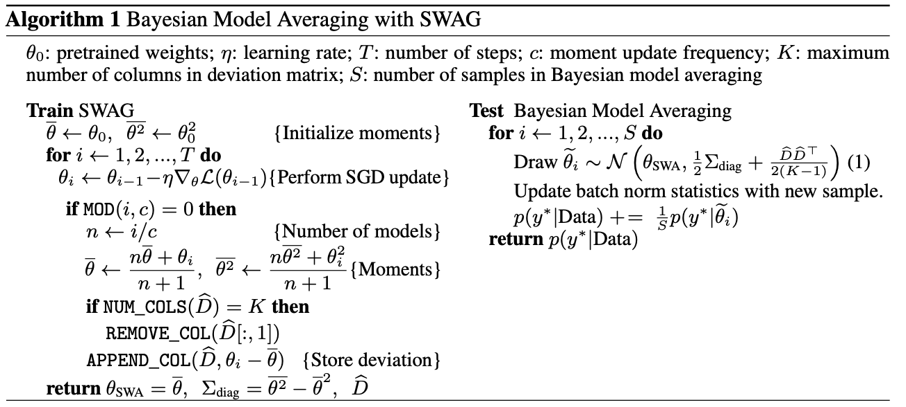

<div align="center">

<h2 align="center">Stochastic Weight Averaging Guassian (SWAG) training on mining signals</h2>

  <p align="center">
    <a href="https://github.com/ShivaHariSonu/eqBlast"><strong>Explore the docs »</strong></a>
  </p>
</div>

<!-- TABLE OF CONTENTS -->
<details>
  <summary>Table of Contents</summary>
  <ol>
    <li>
      <a href="#about-the-project">About The Project</a>
      <ul>
        <li><a href="#built-with">Built With</a></li>
      </ul>
    </li>
    <li>
      <a href="#getting-started">Getting Started</a>
      <ul>
        <li><a href="#installation">Installation</a></li>
        <li><a href="#system-requirements">System Requirements</a></li>
        <li><a href="#model-training">Model Training</a></li>
      </ul>
    </li>
    <li><a href="#contact">Contact</a></li>
    <li><a href="#references">References</a></li>
  </ol>
</details>


<!-- ABOUT THE PROJECT -->
## About The Project

This project focusses on implementing SWA-Guassian (SWAG) algorithm, a scalable approach for uncertainity representation and calibration in the context of classification.

Stochastic Weight Averaging (SWA) computes the first moment of stochastic gradient descent (SGD). With SWAG, we fit the Gaussian using the SWA solution as the first moment and a low rank plus diagonal covariance that got derived from the SGD iterates, forming an approximate posterior distribution over neural network weights and then we sample from this Gaussian distribution to perform Bayesian model averaging. By plotting calibration curves, we can show that SWAG performs well on out of sample detection and posterior probability calibration.

Outline of the algorithm is presented below.


<p align="right">(<a href="#readme-top">back to top</a>)</p>


### Built With

* <a href="https://pytorch.org/">PyTorch </a>
* <a href="https://www.nvidia.com/en-us/geforce/graphics-cards/30-series/rtx-3090-3090ti//"> Nvidia 3090</a>

<p align="right">(<a href="#readme-top">back to top</a>)</p>


<!-- GETTING STARTED -->
## Getting Started
To get a local copy up and running, follow these simple steps.
### Installation
1. Clone the repo
   ```sh
   git clone https://github.com/ShivaHariSonu/eqBlast
### System Requirements
Make sure you are connected to a GPU for faster training time and inference and it is better to allocate 32GB of memory for this project

### Model Training
The file `run_swag.py` allows to train SWAG on Mining Dataset. To train SWAG

```sh
python run_swag.py \
      --training_data_path=<TRAINING_FILE_PATH> \
      --validation_data_path=<VALIDATION_FILE_PATH> \
      --loss=<LOSS_FUNCTION> \
      --model=<MODEL> \
      --epochs=<EPOCHS> \
      --lr_init=<LR_INIT> \
      --max_num_models=<COV_MAT_RANK> \
      --wd=<WD> \
      --swa \
      --swa_start=<SWA_START> \
      --swa_lr=<SWA_LR> \
      --dir=<DIR> \
      --dataset=<DATASET> \
      --batch_size=<BATCH_SIZE> \
      [--cov_mat \]
      [--use_test \]
```

Parameters 

* `DIR` -- path to training directory where checkpoints will be stored
* `DATASET` -- default is set to 'custom' to train on mining dataset.
* `TRAINING_FILE_PATH` -- Path to the train.h5 file.
* `VALIDATION_FILE_PATH` -- Path to validate.h5 file.
* `MODEL` -- 
    CNN1:- to train CNN model. LeNet5 to train LENET mode, PreResNet8 to train Residual Networks
* `EPOCHS` — number of training epochs (default: 200)
* `COV_MAT_RANK` -- Rank of the Covariance matrix used.
* `LOSS` -- Loss Function used for training
* `LR_INIT` — initial learning rate (default: 0.1)
* `WD` — weight decay (default: 1e-4)
* `SWA_START` — the number of epoch after which SWA will start to average models (default: 161)
* `SWA_LR` — SWA learning rate (default: 0.05)
* `--cov_mat` — store covariance matrices with SWAG
* `--use_test` — validation data is used for evaluation.


Sample Script

```sh
python3 run_swag.py --training_data_path train.h5 --validation_data_path validate.h5 --epochs 200 --model CNN1 --lr_init 0.1 --wd 3e-4 --swa --swa_start 101 --swa_lr 0.05 --cov_mat --use_test --dir CNN1models --batch_size 32 --dataset custom --loss BCE_logit —max_num_models=20
```

### Model Inference
The file `testBaseSWAG.py` evaluates the predictions of the models trained with `run_swag.py`

```sh
python testBaseSWAG.py \
      --file=<FILE> \
      --training_data_path=<TRAINING_FILE_PATH> \
      --test_data_path=<VALIDATION_FILE_PATH> \
      --dataset=<DATASET> \
      --save_path=<SAVEPATH> \
      --model=<MODEL> \
      --method=<METHOD> \
      --scale=<SCALE> \
      --N=<SAMPLES> \
       --max_num_models=<COV_MAT_RANK> \
      [--cov_mat \]
      [--use_test \]
```
Parameters:

* `FILE` — path to the model checkpoint
* `SAVEPATH` — path to save the predictions of the model
* `METHOD` — method to evaluate - SWAG - KFACLaplace - SGD - Dropout - SWAGDrop
* `SCALE` — scale parameter for re-scaling the posterior approximation; in the experiments we set it equal to 0.5 for SWAG
* `SAMPLES` — number of samples from the approximate posterior to use in Bayesian model averaging (default: 30)
* `COV_MAT_RANK` -- Rank of the Covariance matrix used.


Sample Script

```sh
python3 testBaseSWAG.py --training_data_path=train.h5 --test_data_path=validate.h5 --model=LeNet5 --use_test --cov_mat --method=SWAG --N=100 --scale=0.5 --max_num_models=20 --file=LeNet5models/k-20/swag-200.pt --save_path=lenet5_inference/k-20/cnn_200_r100
```


<!-- ACKNOWLEDGMENTS -->
## References
List of resources we found helpful and would like to give credit to!
* https://arxiv.org/abs/1902.02476
* https://github.com/wjmaddox/swa_gaussian

<p align="right">(<a href="#readme-top">back to top</a>)</p>


